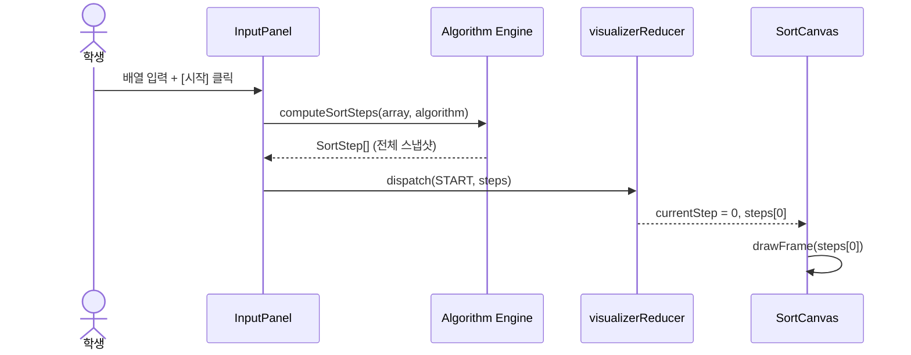
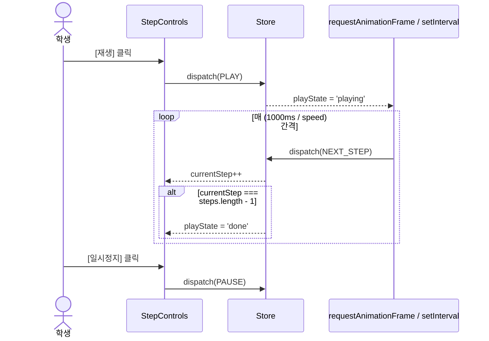

# Tech Spec: 알고리즘 시각화 플레이그라운드

---

## 1. 문서 정보

| 항목 | 내용 |
|------|------|
| **작성일** | 2026-04-19 |
| **상태** | Draft |
| **버전** | v0.1 |
| **원문 PRD** | algo-playground-prd.md |
| **작성자** | insang@hansung.ac.kr |

---

## 2. 시스템 아키텍처

### 2-1. 아키텍처 패턴

| 패턴 | 선택 이유 |
|------|-----------|
| Feature-based SPA (Pure Frontend) | 백엔드·DB가 불필요한 순수 클라이언트 시각화 앱. 알고리즘 시퀀스를 클라이언트에서 사전 계산(pre-compute)하여 서버 왕복 비용 제로. |
| Renderer 분리 (Canvas Renderer Layer) | UI 컴포넌트(React)와 그래픽 렌더링(Canvas API)을 레이어로 분리하여, 렌더러 교체(SVG, WebGL 등)가 React 컴포넌트에 영향을 주지 않도록 설계. |
| Step Sequence Pre-computation | 알고리즘 실행 결과를 불변(immutable) 스냅샷 배열로 미리 계산하여 저장. 이전/다음 이동을 O(1) 인덱스 접근으로 처리. |

### 2-2. 컴포넌트 구성도

```mermaid
graph TD
    App["App (라우터 + 전역 상태)"]

    subgraph UI["UI Layer (React)"]
        AlgoSelector["AlgorithmSelector\n알고리즘 탭 선택"]
        InputPanel["InputPanel\n배열/그래프 입력"]
        StepControls["StepControls\n이전·다음·재생·속도"]
        StepIndicator["StepIndicator\n스텝 N / M 표시"]
    end

    subgraph Canvas["Canvas Layer"]
        VisualizationCanvas["VisualizationCanvas\n(React ref → canvas DOM)"]
        SortRenderer["SortRenderer\n막대 + 색상 렌더"]
        GraphRenderer["GraphRenderer\n노드·엣지 렌더"]
    end

    subgraph Engine["Algorithm Engine (순수 함수)"]
        BubbleSort["bubbleSort()"]
        SelectionSort["selectionSort()"]
        InsertionSort["insertionSort()"]
        BFS["bfs()"]
        DFS["dfs()"]
    end

    subgraph State["State Layer (useReducer)"]
        VisualizerStore["visualizerReducer\ncurrentStep / steps[] / playState / speed"]
    end

    App --> AlgoSelector
    App --> InputPanel
    App --> VisualizationCanvas
    App --> StepControls
    App --> StepIndicator

    AlgoSelector -->|알고리즘 변경| State
    InputPanel -->|입력 → Engine 호출| Engine
    Engine -->|StepSnapshot[]| State
    State -->|currentStep| VisualizationCanvas
    VisualizationCanvas --> SortRenderer
    VisualizationCanvas --> GraphRenderer
    StepControls -->|dispatch| State
```

### 2-3. 배포 프로파일 (PRD §7 계승)

**프로파일**: W
**근거**: PRD §7에서 "W — GitHub Pages 배포"로 명시. 순수 정적 빌드이므로 GitHub Pages가 최적.

| 환경 | 호스팅 | L에서 포함 | W에서 포함 |
|------|--------|:---------:|:---------:|
| Frontend (Vite 빌드 결과물) | GitHub Pages | ✅ | ✅ |
| Backend | 해당 없음 (순수 SPA) | — | — |
| Database | 해당 없음 (상태는 메모리 내) | — | — |
| CI Gate (lint + Vitest + Playwright E2E) | GitHub Actions | ✅ | ✅ |
| CD (GitHub Pages 자동 배포) | GitHub Actions → gh-pages | — | ✅ |

> **CD 이슈**는 `/cicd-pipeline` 스킬로 별도 생성. 이 TechSpec은 CI Gate까지만 책임진다.

---

## 3. 기술 스택

| 분류 | 기술 | 버전 | 선정 이유 |
|------|------|------|-----------|
| UI 프레임워크 | React | 18.x | 컴포넌트 기반 상태 관리, 생태계 안정성 |
| 언어 | TypeScript | 5.x | 알고리즘 스텝 타입을 엄격하게 정의, 실수 방지 |
| 빌드 도구 | Vite | 5.x | HMR 빠름, GitHub Pages 정적 배포에 최적 |
| 렌더링 | Canvas API (native) | — | 외부 라이브러리 없이 60fps 애니메이션 구현 가능. 교육 목적상 브라우저 표준 API 직접 노출. |
| 스타일링 | Tailwind CSS | 3.x | 유틸리티 클래스로 빠른 레이아웃 구성, 커스텀 디자인 토큰 적용 용이 |
| 상태 관리 | React useReducer | (내장) | 외부 라이브러리 없이 시각화 상태 흐름을 명시적으로 관리 |
| 단위 테스트 | Vitest | 1.x | Vite 기반 프로젝트와 제로 설정 통합 |
| E2E 테스트 | Playwright | 1.x | 멀티 브라우저(Chromium/Firefox/WebKit) 지원 |
| 린터 | ESLint + Prettier | latest | 코드 일관성 유지 |
| CI/CD | GitHub Actions | — | PR 트리거 lint·test·E2E, main 머지 시 Pages 배포 |

---

## 4. 데이터 모델

백엔드·DB가 없으므로 런타임 메모리 내 TypeScript 타입으로 정의한다.

### 4-1. 정렬 알고리즘 스텝

```typescript
/** 정렬 시각화의 단일 스텝 스냅샷 */
interface SortStep {
  array: number[];          // 해당 스텝의 배열 상태 (불변 복사본)
  comparing: [number, number] | null;  // 현재 비교 중인 인덱스 쌍
  swapped: [number, number] | null;    // 이번 스텝에서 swap된 인덱스 쌍
  sorted: number[];         // 정렬 확정된 인덱스 목록 (초록색 표시)
  description: string;      // 스텝 설명 (예: "인덱스 2와 3을 비교합니다")
}

type SortAlgorithm = 'bubble' | 'selection' | 'insertion';
```

### 4-2. 그래프 탐색 스텝

```typescript
interface GraphNode {
  id: string;
  label: string;
  x: number;   // Canvas 좌표 (0~1 정규화)
  y: number;
}

interface GraphEdge {
  from: string;
  to: string;
}

interface Graph {
  nodes: GraphNode[];
  edges: GraphEdge[];
}

/** 그래프 탐색의 단일 스텝 스냅샷 */
interface GraphStep {
  visitedNodes: string[];     // 방문 완료된 노드 ID 목록
  currentNode: string | null; // 현재 방문 중인 노드 ID
  activeEdge: [string, string] | null; // 현재 탐색 중인 엣지
  queue: string[];            // BFS 큐 또는 DFS 스택 현재 상태
  description: string;
}

type GraphAlgorithm = 'bfs' | 'dfs';
```

### 4-3. 시각화 전역 상태

```typescript
type PlayState = 'idle' | 'playing' | 'paused' | 'done';
type AlgorithmType = SortAlgorithm | GraphAlgorithm;

interface VisualizerState {
  algorithm: AlgorithmType;
  currentStep: number;
  steps: SortStep[] | GraphStep[];  // 미리 계산된 전체 스텝 시퀀스
  playState: PlayState;
  speed: 0.5 | 1 | 1.5 | 2;        // 재생 배속
  inputArray: number[];             // 정렬용 입력
  graph: Graph;                     // 그래프 탐색용 입력
  startNode: string;
  error: string | null;
}

type VisualizerAction =
  | { type: 'SET_ALGORITHM'; payload: AlgorithmType }
  | { type: 'SET_INPUT'; payload: number[] | Graph }
  | { type: 'START'; payload: SortStep[] | GraphStep[] }
  | { type: 'NEXT_STEP' }
  | { type: 'PREV_STEP' }
  | { type: 'PLAY' }
  | { type: 'PAUSE' }
  | { type: 'RESET' }
  | { type: 'SET_SPEED'; payload: VisualizerState['speed'] }
  | { type: 'SET_ERROR'; payload: string };
```

---

## 5. API 명세

해당 없음 — 순수 클라이언트 SPA이며 외부 API 호출 없음.

알고리즘 엔진은 순수 함수(pure function)로 구현되어 외부 통신 없이 스텝 시퀀스를 반환한다.

```typescript
// 알고리즘 엔진 인터페이스 (순수 함수)
function computeSortSteps(array: number[], algorithm: SortAlgorithm): SortStep[]
function computeGraphSteps(graph: Graph, startNode: string, algorithm: GraphAlgorithm): GraphStep[]
```

---

## 6. 상세 기능 명세

### 6-1. Frontend 컴포넌트 트리

```
src/
├── App.tsx                         # 루트: 전역 state + layout
├── features/
│   ├── sort/
│   │   ├── engines/
│   │   │   ├── bubbleSort.ts       # computeSortSteps 구현
│   │   │   ├── selectionSort.ts
│   │   │   └── insertionSort.ts
│   │   ├── SortInputPanel.tsx      # 배열 입력 폼
│   │   └── SortCanvas.tsx          # Canvas 렌더러 (막대그래프)
│   └── graph/
│       ├── engines/
│       │   ├── bfs.ts              # computeGraphSteps 구현
│       │   └── dfs.ts
│       ├── GraphInputPanel.tsx     # 노드/엣지 입력 폼
│       └── GraphCanvas.tsx         # Canvas 렌더러 (원+선)
├── components/
│   ├── AlgorithmSelector.tsx       # 알고리즘 탭 선택 UI
│   ├── StepControls.tsx            # 이전·다음·재생·속도 슬라이더
│   └── StepIndicator.tsx           # "스텝 N / M" 표시
├── store/
│   └── visualizerReducer.ts        # useReducer 스토어
└── types/
    └── index.ts                    # 공유 타입 정의
```

### 6-2. 핵심 로직 시퀀스

#### 정렬 시각화 시작 흐름



#### 자동 재생 흐름



### 6-3. Canvas 렌더러 명세

#### SortCanvas 렌더링 규칙

| 상태 | 색상 | 설명 |
|------|------|------|
| 기본 원소 | `#94a3b8` (회색) | 비교 대상 아님 |
| 비교 중 (`comparing`) | `#f97316` (주황) | 현재 비교 중인 두 원소 |
| 교환됨 (`swapped`) | `#ef4444` (빨강) | 이번 스텝에서 swap 발생 |
| 정렬 확정 (`sorted`) | `#22c55e` (초록) | 최종 위치 확정 |

- 막대 높이: `array[i] / max(array) * canvasHeight * 0.9`
- 막대 너비: `canvasWidth / array.length - 2px (간격)`
- 애니메이션: CSS transition 대신 `requestAnimationFrame` 으로 직접 보간 (60fps 목표)

#### GraphCanvas 렌더링 규칙

| 상태 | 노드 색상 | 테두리 |
|------|----------|--------|
| 미방문 | `#94a3b8` (회색) | 없음 |
| 현재 방문 중 | `#f97316` (주황) | 두꺼운 테두리 |
| 방문 완료 | `#22c55e` (초록) | 없음 |

- 노드: 원(radius 24px) + 중앙 레이블 텍스트
- 엣지: 직선 + 화살표 헤드 (`lineTo` + `ctx.stroke`)
- 활성 엣지(`activeEdge`): 주황색 점선으로 표시

### 6-4. 입력값 검증 (클라이언트)

```typescript
// 정렬 입력 검증
function validateSortInput(raw: string): { valid: boolean; array?: number[]; error?: string } {
  const tokens = raw.split(',').map(s => s.trim());
  if (tokens.length < 2 || tokens.length > 20) return { valid: false, error: '원소는 2개 이상 20개 이하여야 합니다.' };
  const nums = tokens.map(Number);
  if (nums.some(isNaN)) return { valid: false, error: '숫자만 입력 가능합니다.' };
  if (nums.some(n => n < 1 || n > 999)) return { valid: false, error: '원소 값은 1~999 범위여야 합니다.' };
  return { valid: true, array: nums };
}
```

### 6-5. 에러 처리

| 시나리오 | 메시지 | 복구 액션 |
|---------|--------|---------|
| 배열이 비어 있음 | "배열을 입력해주세요. 예) 5, 3, 8, 1" | 입력창 포커스 |
| 범위 초과 | "원소는 2~20개, 값은 1~999여야 합니다." | 입력창 포커스 |
| 엔진 예외 발생 | "앗, 시각화를 불러오지 못했어요. 다시 시도해볼까요?" | [다시 시작] 버튼 |
| 노드 미도달 | "일부 노드는 도달할 수 없어요." | 회색 처리 후 계속 |

---

## 7. UI/UX 스타일 가이드

### 7-1. 디자인 토큰 (Tailwind 커스텀)

```js
// tailwind.config.js
theme: {
  extend: {
    colors: {
      'viz-default':   '#94a3b8',  // slate-400
      'viz-comparing': '#f97316',  // orange-500
      'viz-swapped':   '#ef4444',  // red-500
      'viz-sorted':    '#22c55e',  // green-500
      'viz-bg':        '#0f172a',  // slate-900 (캔버스 배경)
    }
  }
}
```

### 7-2. 타이포그래피

| 용도 | 클래스 |
|------|--------|
| 제목 | `text-xl font-bold text-slate-100` |
| 스텝 표시 | `text-sm font-mono text-slate-400` |
| 설명 텍스트 | `text-sm text-slate-300` |
| 버튼 | `text-sm font-medium` |

### 7-3. 공통 컴포넌트 사양

| 컴포넌트 | 크기 | 상태 |
|---------|------|------|
| 기본 버튼 | `px-4 py-2 rounded-lg` | default / disabled / active |
| 입력 필드 | `w-full px-3 py-2 rounded border` | default / error / disabled |
| 속도 슬라이더 | `w-32` | 0.5 / 1 / 1.5 / 2 (4단계 스냅) |
| 탭 (알고리즘 선택) | `px-3 py-1 rounded-full` | active / inactive |

### 7-4. 레이아웃 (반응형)

```
┌─────────────────────────────────┐
│ AlgorithmSelector (탭)           │  ← 상단 고정
├─────────────────────────────────┤
│ InputPanel                       │  ← 배열 or 그래프 입력
├─────────────────────────────────┤
│                                  │
│   VisualizationCanvas            │  ← 화면의 60%
│                                  │
├─────────────────────────────────┤
│ StepIndicator   StepControls     │  ← 하단 고정
└─────────────────────────────────┘
```

- 브레이크포인트: `sm(640px)` / `md(768px)` / `lg(1024px)`
- 모바일: 캔버스 100vw, 컨트롤 버튼 크기 확대 (`touch-target 44px` 이상)
- 태블릿 이상: 좌측 InputPanel + 우측 Canvas 2-column 레이아웃

### 7-5. 접근성

- 모든 버튼에 `aria-label` 명시 (예: `aria-label="다음 단계"`)
- 재생 중 버튼 상태 변화는 `aria-pressed` 속성으로 표현
- 캔버스에 `role="img"` + `aria-label="버블소트 시각화 캔버스"` 적용
- 키보드: `←` / `→` 방향키로 이전/다음 스텝 이동

---

## 8. 개발 마일스톤

### Phase 1 — Walking Skeleton (L0)
**목표**: 앱이 기동되고, 더미 알고리즘 1개가 캔버스에 렌더링되며, Playwright E2E가 CI에서 통과한다.

- 프로젝트 구조 및 빌드 설정 (Vite + React + TypeScript + Tailwind)
- `visualizerReducer` 뼈대 + `StepControls` UI 껍데기
- `VisualizationCanvas` → Canvas ref 연결 + 더미 drawFrame
- CI Gate (ESLint + Vitest + Playwright E2E 스캐폴드)
- Playwright 시나리오 1개: "홈 접속 → 캔버스 엘리먼트 존재 확인"

### Phase 2 — 핵심 기능 구현 (L1 + L2 첫 슬라이스)

**목표**: 버블소트 시각화 end-to-end 동작.

- 공유 타입 정의 (`SortStep`, `GraphStep`, `VisualizerState`)
- `bubbleSort` 엔진 + 단위 테스트 (Vitest)
- `SortCanvas` 렌더러 (막대 색상 + 스텝 보간)
- `SortInputPanel` 검증 포함
- 스텝 제어 완전 동작 (이전/다음/재생/속도)
- E2E: "배열 입력 → 시작 → 다음 버튼 3회 → 배열 상태 변경 확인"

### Phase 3 — 기능 확장 (L2 나머지 슬라이스)

**목표**: 선택정렬·삽입정렬·BFS·DFS 추가.

- `selectionSort`, `insertionSort` 엔진 + E2E
- `GraphInputPanel`, `GraphCanvas` 렌더러
- `bfs`, `dfs` 엔진 + E2E
- 알고리즘 전환 시 상태 초기화 처리
- 미도달 노드 회색 처리 + "일부 노드 도달 불가" 메시지

### Phase 4 — 안정화 및 배포 (L3 + L4)

**목표**: 교차 시나리오 E2E 통과, GitHub Pages 배포 자동화.

- 알고리즘 전환 교차 E2E (정렬 → 그래프 전환 후 이전 상태 초기화 확인)
- 반응형 레이아웃 검증 (태블릿 뷰포트 Playwright)
- 접근성 검증 (키보드 탐색, aria 속성)
- GitHub Pages CD 워크플로우 (`/cicd-pipeline` 스킬로 별도 생성)
- README 사용 가이드

---

## 부록

### A. 용어 정의

| 용어 | 정의 |
|------|------|
| Step Snapshot | 알고리즘의 특정 시점의 배열/그래프 상태를 담은 불변 객체 |
| Pre-computation | [시작] 버튼 클릭 시 전체 스텝 시퀀스를 한 번에 계산하여 배열로 저장하는 방식 |
| Slice | Vertical Slice — DB(해당 없음) + 엔진 + UI + E2E를 포함하는 사용자 가치 단위 이슈 |
| Walking Skeleton | 핵심 기능 없이 전체 아키텍처를 관통하는 최소 동작 뼈대 |

### B. 미결 사항 (Open Questions)

| # | 질문 | 중요도 | 기한 |
|---|------|--------|------|
| 1 | 그래프 입력 UI — 텍스트(인접행렬) vs 드래그 앤 드롭 노드 배치? | 중 | Phase 3 시작 전 |
| 2 | 버블소트 외 정렬도 막대 외에 숫자 레이블 표시 필요 여부? | 낮 | Phase 2 구현 중 |
| 3 | 속도 슬라이더를 4단계 스냅(0.5/1/1.5/2) vs 연속 범위로 할지? | 낮 | Phase 2 시작 전 |

### C. 변경 이력

| 날짜 | 버전 | 변경 내용 |
|------|------|-----------|
| 2026-04-19 | v0.1 | 최초 작성 |
